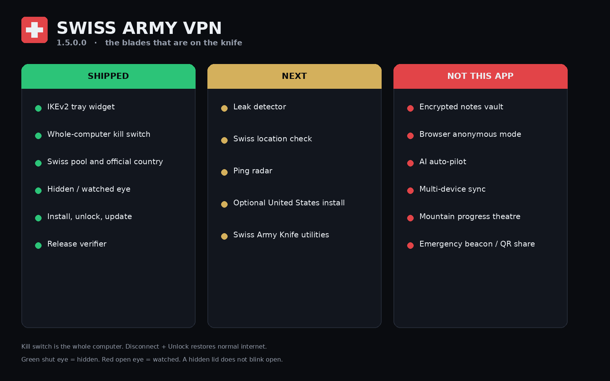

# Justichuu's Swiss Army VPN

A lightweight Windows tray widget for a Swiss Army VPN IKEv2 VPN, backed by Windows' built-in VPN client.


Green shut eye: hidden. Red open eye: watched. The lid moves; a hidden eye does not blink open.

## What it does

- Connects a managed Swiss Army VPN profile.
- Arms a whole-computer, fail-closed Windows Firewall kill switch.
- Shows live tunnel traffic and protected latency on demand.
- Includes an editable Swiss server dropdown and an optional custom NordVPN-country mode.
- Verifies exact assets from immutable private releases.
- Includes install, uninstall, emergency unlock, and PowerShell backup tools.

## Install

1. Open the [latest GitHub Release](https://github.com/Justichuu/The-Swiss-Army-VPN/releases/latest).
2. Download `Swiss Army VPN Distribution <VERSION>.zip`. Do not use the green **Code → Download ZIP** option; that archive contains source code, not the compiled application.
3. Keep the matching `Swiss Army VPN Source <VERSION>.zip` beside it when sharing the application.
4. Extract the distribution ZIP and keep the folder structure intact.
5. Run `Install Swiss Army VPN.exe` from the extracted folder.
   - The installer relies on `Programs\PowershellBackup\Install Swiss Army VPN.ps1` being present in the distribution.
6. Open the widget and choose **SET UP SIGN-IN**.

Release engineering incidents and their corrective actions are documented in
[`docs/incidents`](docs/incidents/).

Credentials are never included. Use valid NordVPN manual-service credentials. Installing or changing protection requires administrator approval.

GitHub is current. `git fetch` then `git pull` in the clone. Program Files is the installed widget and does not change when git pulls.

## Choose a VPN server

The widget's editable **SERVER** dropdown lists the packaged Swiss server pool. Select an entry or type a hostname, then choose **APPLY**. Swiss-only mode accepts `ch<number>.nordvpn.com`. Enable **Allow any NordVPN country server** to enter another official numbered endpoint such as `us1234.nordvpn.com`.

Disconnect and unlock before changing servers. Administrator approval is required because the switch updates the all-users Windows VPN profile, `VPN Server.txt`, and the protected installation record together. It validates DNS first and rolls all three values back if the update cannot be verified.

The Start-menu **Choose Swiss VPN Server** tool remains available for automatic selection. It fetches NordVPN's current online Swiss IKEv2 list, chooses the lowest-load resolvable server, and falls back to `VPN Servers.txt` when the live service is unavailable. Advanced users can run `Switch Swiss Army VPN Server.ps1 -List`, select a Swiss endpoint with `-Server ch123.nordvpn.com`, or deliberately allow another country with `-Server us1234.nordvpn.com -AllowAnyNordVpn`.

The first release containing a new package file may require one manual install because older exact-allowlist updaters reject unfamiliar files. Run `Install Swiss Army VPN.exe`; subsequent compatible releases can update normally. The `.cmd` launcher remains available only as a troubleshooting fallback.

Private updates require system-wide GitHub CLI 2.96+ and `gh auth login` with an account that can read this repository. The account approving the update must have access too. No GitHub token is stored in the app.

## Build

From Windows PowerShell:

```powershell
powershell.exe -NoProfile -ExecutionPolicy Bypass -File .\scripts\Build-Release.ps1
```

Build output goes to `artifacts\builds\<version>\` - each version gets its own folder. The build validates PowerShell syntax, package checksums, executable metadata, and the installer payload.

## Important

The kill switch affects the whole computer while armed. The app may disconnect other active Windows RAS VPN sessions during a controlled connection change. Use **DISCONNECT + UNLOCK** to restore normal internet.

Current builds are unsigned, so Windows SmartScreen may show a warning. The release verifier makes checksum verification one click, but it does not turn an unsigned executable into a code-signed one.



## Woah

```text
⠀⠀⠀⠀⠀⠀⠀⠀⠀⠀⠀⠀⠀⠀⠀⠀⠀⠀⠀⠀⠀⠀⠀⠀⠀⠀⠀⠀
⢻⣿⡗⢶⣤⣀⠀⠀⠀⠀⠀⠀⠀⠀⠀⠀⠀⠀⠀⠀⠀⠀⠀⠀⠀⠀⠀⣀⣠⣄
⠀⢻⣇⠀⠈⠙⠳⣦⣀⠀⠀⠀⠀⠀⠀⠀⠀⠀⠀⠀⠀⠀⣀⣤⠶⠛⠋⣹⣿⡿
⠀⠀⠹⣆⠀⠀⠀⠀⠙⢷⣄⣀⣀⣀⣤⣤⣤⣄⣀⣴⠞⠋⠉⠀⠀⠀⢀⣿⡟⠁
⠀⠀⠀⠙⢷⡀⠀⠀⠀⠀⠉⠉⠉⠀⠀⠀⠀⠀⠀⠀⠀⠀⠀⠀⠀⣠⡾⠋⠀⠀
⠀⠀⠀⠀⠈⠻⡶⠂⠀⠀⠀⠀⠀⠀⠀⠀⠀⠀⠀⠀⠀⠀⢠⣠⡾⠋⠀⠀⠀⠀
⠀⠀⠀⠀⠀⣼⠃⠀⢠⠒⣆⠀⠀⠀⠀⠀⠀⢠⢲⣄⠀⠀⠀⢻⣆⠀⠀⠀⠀⠀
⠀⠀⠀⠀⢰⡏⠀⠀⠈⠛⠋⠀⢀⣀⡀⠀⠀⠘⠛⠃⠀⠀⠀⠈⣿⡀⠀⠀⠀⠀
⠀⠀⠀⠀⣾⡟⠛⢳⠀⠀⠀⠀⠀⣉⣀⠀⠀⠀⠀⣰⢛⠙⣶⠀⢹⣇⠀⠀⠀⠀
⠀⠀⠀⠀⢿⡗⠛⠋⠀⠀⠀⠀⣾⠋⠀⢱⠀⠀⠀⠘⠲⠗⠋⠀⠈⣿⠀⠀⠀⠀
⠀⠀⠀⠀⠘⢷⡀⠀⠀⠀⠀⠀⠈⠓⠒⠋⠀⠀⠀⠀⠀⠀⠀⠀⠀⢻⡇⠀⠀⠀
⠀⠀⠀⠀⠀⠈⡇⠀⠀⠀⠀⠀⠀⠀⠀⠀⠀⠀⠀⠀⠀⠀⠀⠀⠀⢸⣧⠀⠀⠀
⠀⠀⠀⠀⠀⠈⠉⠉⠉⠉⠉⠉⠉⠉⠉⠉⠉⠉⠉⠉⠉⠉⠉⠉⠉⠉⠁⠀⠀⠀
```

This is an unofficial project cuz Nord app be hefty. It is not affiliated with or endorsed by NordVPN. Licensed under GPL-3.0-only.
