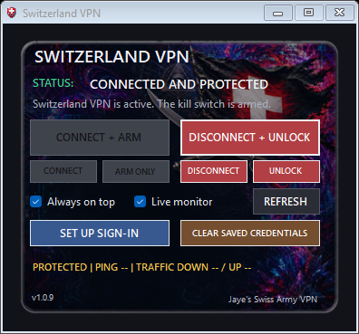

# Jaye's Swiss Army VPN

A lightweight Windows tray widget for a Switzerland IKEv2 VPN, backed by Windows' built-in VPN client.



## What it does

- Connects a managed Switzerland VPN profile.
- Arms a whole-computer, fail-closed Windows Firewall kill switch.
- Shows live tunnel traffic and protected latency on demand.
- Includes an optional Swiss server pool and a safe best-server switcher.
- Verifies exact assets from immutable private releases.
- Includes install, uninstall, emergency unlock, and PowerShell backup tools.

## Install

1. Download both ZIP files from the latest GitHub Release.
2. Keep the source ZIP with the application ZIP when sharing it.
3. Extract the application ZIP and run `Install Switzerland VPN.cmd`.
4. Open the widget and choose **SET UP SIGN-IN**.

Credentials are never included. Use valid NordVPN manual-service credentials. Installing or changing protection requires administrator approval.

## Backup Swiss servers

The install keeps one Windows VPN profile so credentials and kill-switch ownership stay unambiguous. If its server stops working, disconnect and unlock first, then open **Choose Swiss VPN Server** from the Start menu. It requests administrator approval, fetches NordVPN's current online Swiss IKEv2 list, chooses the lowest-load server that resolves, and updates the managed profile and installation record together. Advanced users can run `Switch Switzerland VPN Server.ps1 -List` to inspect candidates or add `-Server ch123.nordvpn.com` to select one explicitly. `VPN Servers.txt` is a seed pool used only when the live service is unavailable.

The first release containing this feature adds files that older exact-allowlist updaters do not recognize. Install that release once with `Install Switzerland VPN.cmd`; subsequent releases can update the pool normally.

Private updates require system-wide GitHub CLI 2.96+ and `gh auth login` with an account that can read this repository. The account approving the update must have access too. No GitHub token is stored in the app.

## Build

From Windows PowerShell:

```powershell
powershell.exe -NoProfile -ExecutionPolicy Bypass -File .\scripts\Build-Release.ps1
```

Build output goes to `artifacts\`. The build validates PowerShell syntax, package checksums, executable metadata, and the installer payload.

## Important

The kill switch affects the whole computer while armed. The app may disconnect other active Windows RAS VPN sessions during a controlled connection change. Use **DISCONNECT + UNLOCK** to restore normal internet.

Current builds are unsigned, so Windows SmartScreen may show a warning.

This is an unofficial project and is not affiliated with or endorsed by NordVPN. Licensed under GPL-3.0-only.
